# EasyStay Hotel Booking

The project has been made with MERN stack comprising of Tailwind CSS and the integration of Stripe Payment Gateway System.
This Web-application contains features like:

- User can login using CLerk Authentication Mechanism and can become a Hotel Owner on filling the Registeration Form
- HotelOwner can able to add, delete or change the images of the hotel rooms plus gain the facilites of creating a new room for a specific hotel
- Users other than the hotel Owner can book and check the availabilty of rooms by filtering based search options and on the basis of that one can book the room with a secure payment gateway, Stripe.

## Tech Stack

**Frontend:** ReactJS, JavaScript, Tailwind CSS

**Backend:** Node, Express

**Database:** MongoDB,

**Libraries:** clerk/express, cors, cloudinary, toast, dotenv

**Cloud System:** Cloudinary, Brevo

## To Run Application Locally

```bash
  $ git clone https://github.com/kaayush163/MERN_EasyStay_HotelBooking.git
```

```bash
  $ cd MERN_EasyStay_HotelBooking
```

```bash
  $ npm i
```

```bash
  In .env file of client directory, put the VITE_BACKEND_URL=http://localhost:3000 for local server connection and VITE_CLERK_PUBLISHABLE_KEY
```

```bash
  In .env file of server directory, put the MONGODB_URI so that mongodb atlas establishes a connection with a specific cluster, plus add other API_KEYS also like:
  (a) For CLERK
    CLERK_PUBLISHABLE_KEY
    CLERK_SECRET_KEY
    CLERK_WEBHOOK_SECRET
  (b) For Cloudinary
    CLOUDINARY_CLOUD_NAME
    CLOUDINARY_API_KEY
    CLOUDINARY_API_SECRET
  (c) For NodeMailer
    SENDER_EMAIL
    SMTP_USER
    SMTP_PASS
```

```bash
  First run Local server:
```

```bash
  $ cd server
```

```bash
  $ npm i
```

```bash
  $ npm run server
```

```bash
  Run Client
```

```bash
  $ cd client
```

```bash
  $ npm i
```

```bash
  $ npm run dev
```

## Screenshots

|                      Home Page                       |                Login Page(Clerk auth)                |
| :--------------------------------------------------: | :--------------------------------------------------: |
|  | 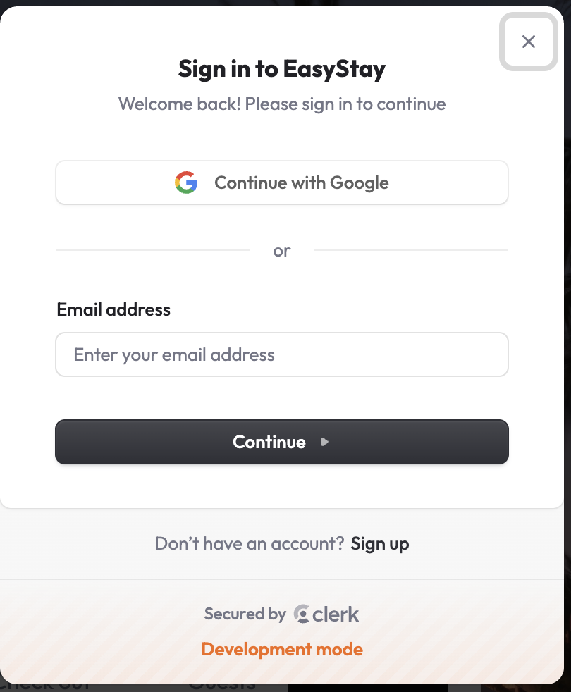 |

|                   Account Details                    |             Featured Destination section             |
| :--------------------------------------------------: | :--------------------------------------------------: |
| 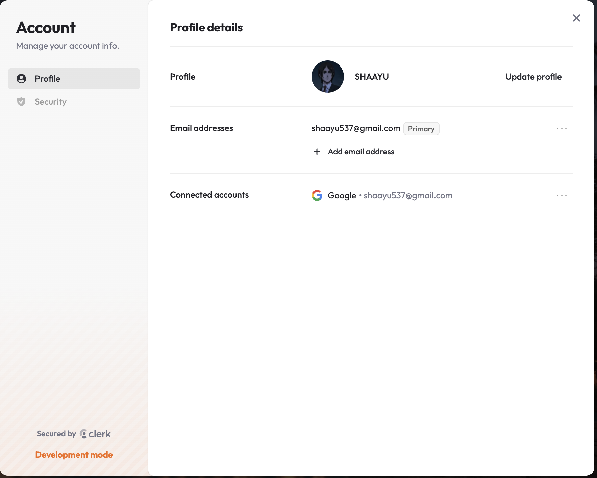 | 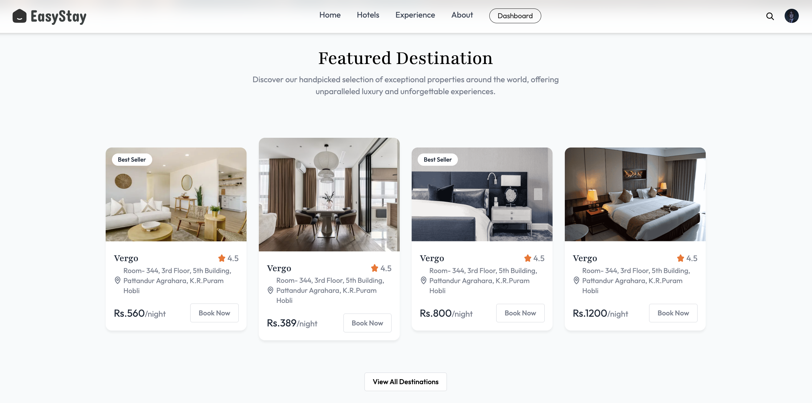 |

|                 All Rooms Dashboard                  |                 Specific Room Detail                 |
| :--------------------------------------------------: | :--------------------------------------------------: |
| 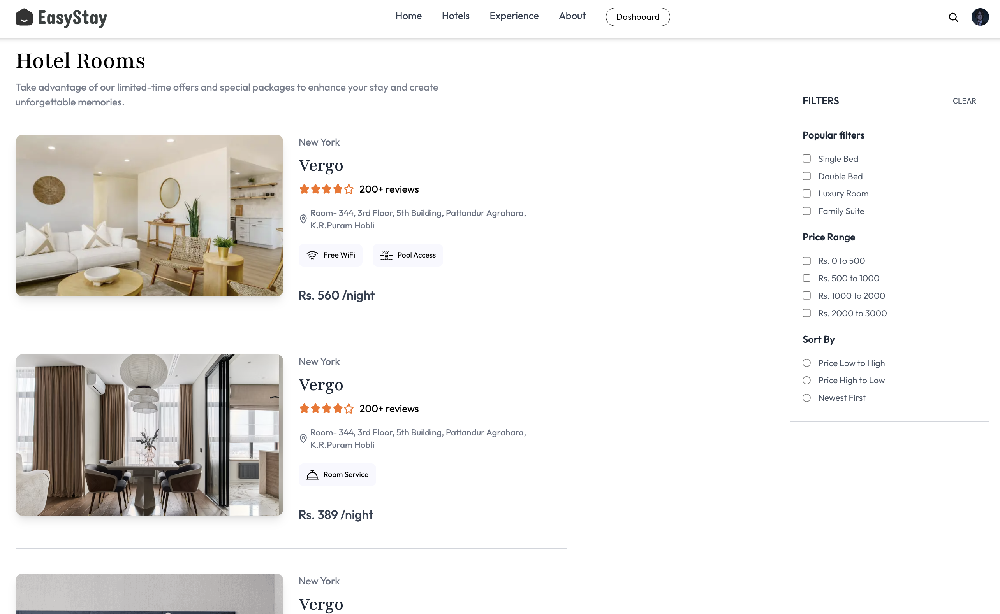 | 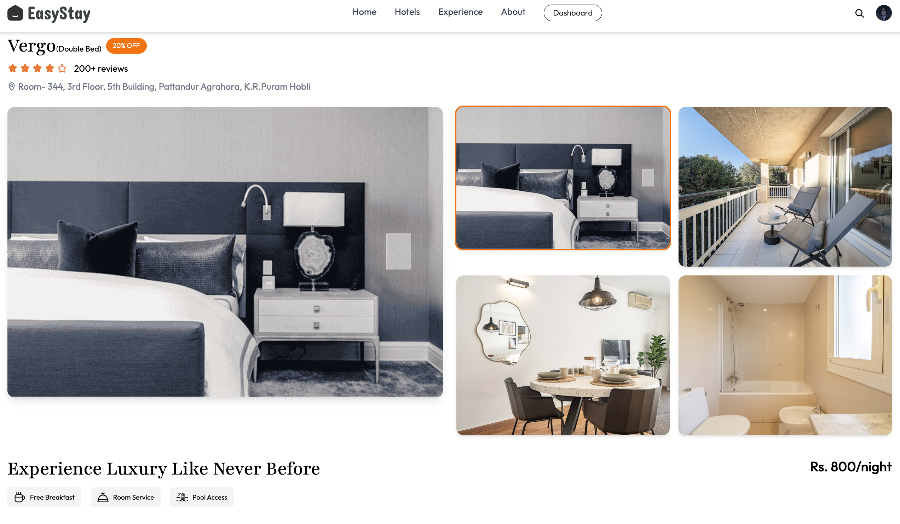 |

|          Check Availabilty/Book Now Option           |                 MyBookings Dashboard                 |
| :--------------------------------------------------: | :--------------------------------------------------: |
| 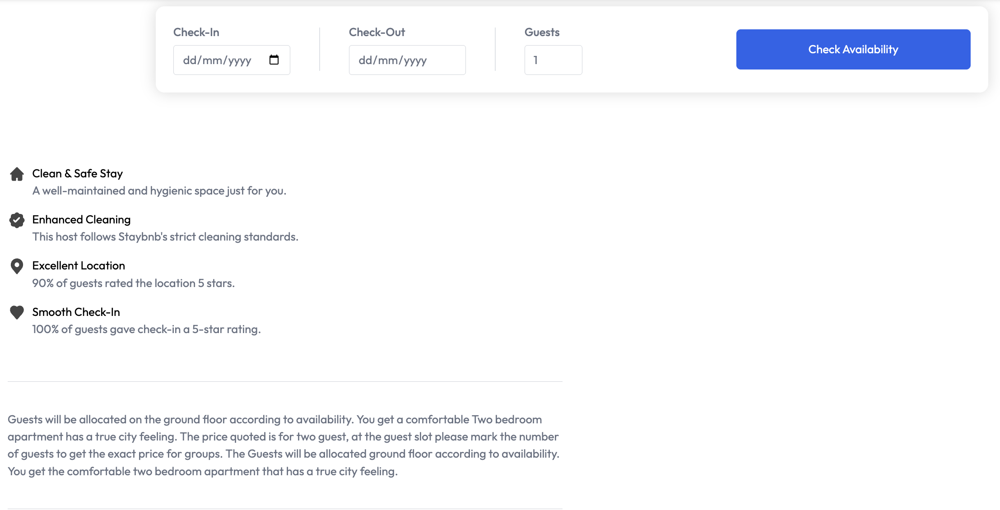 | 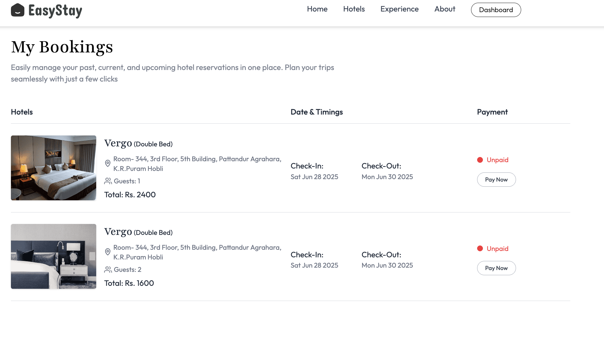 |

|                 Stripe Payment Page                  |                      Paid Status                      |
| :--------------------------------------------------: | :---------------------------------------------------: |
| 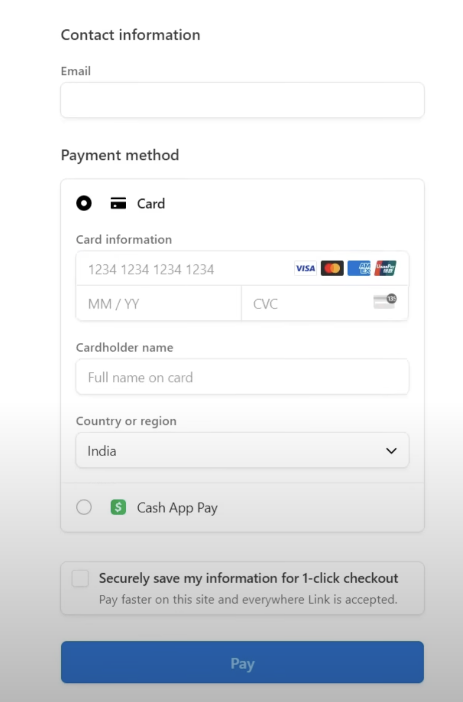 | 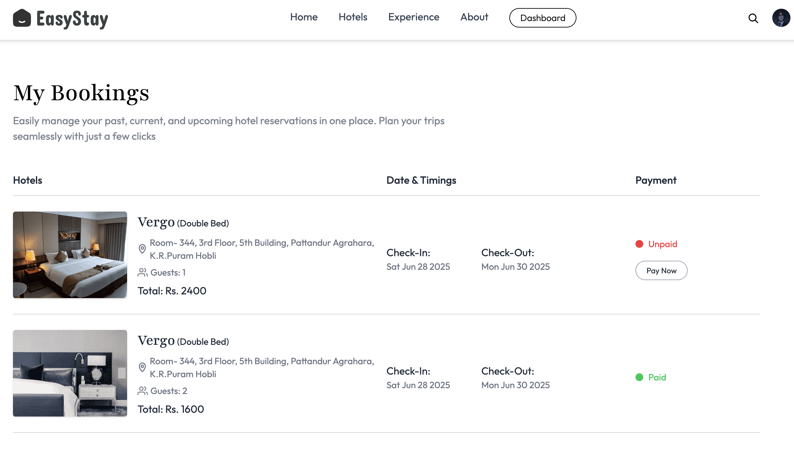 |

|               Booking Confirmation Mail               |                 HotelOwner Dashboard                  |
| :---------------------------------------------------: | :---------------------------------------------------: |
| 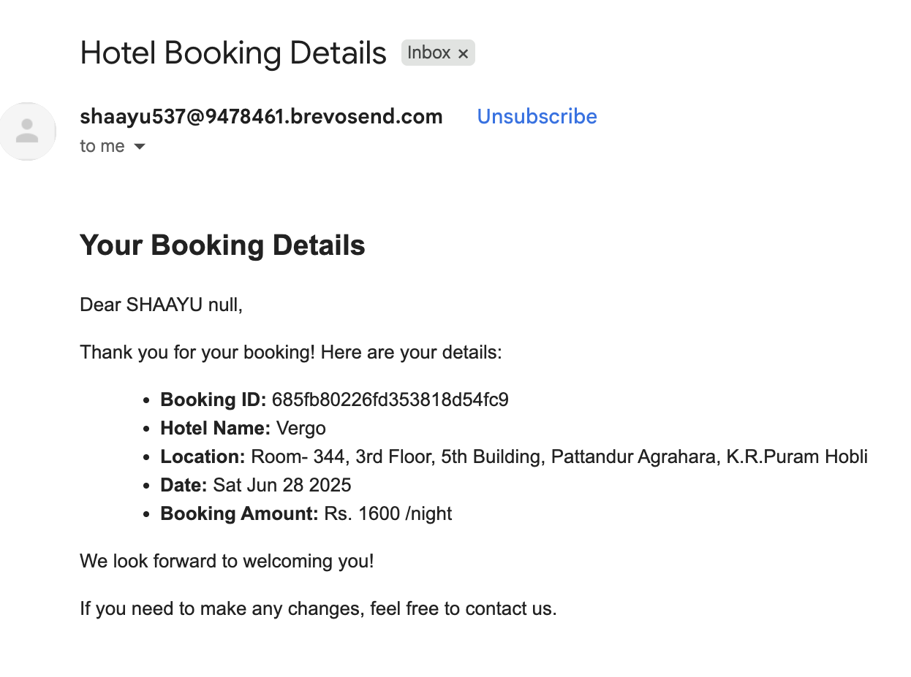 | 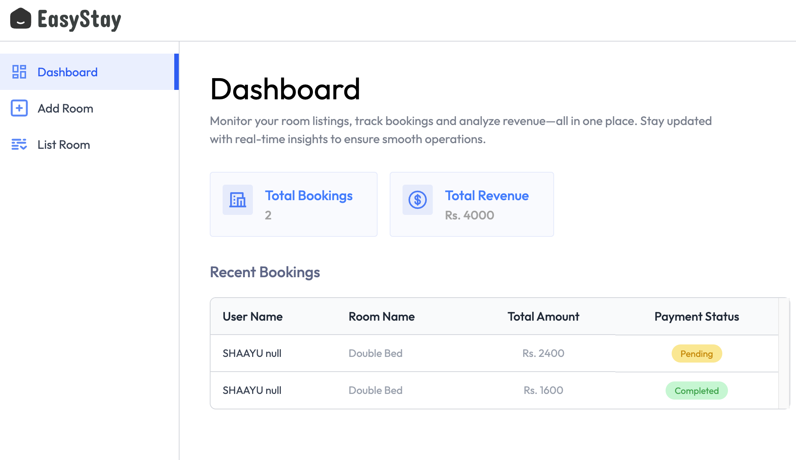 |

|           Add Rooms facility by Hotel Owner           |        List of Rooms Monitored by Hotel Owner         |
| :---------------------------------------------------: | :---------------------------------------------------: |
| 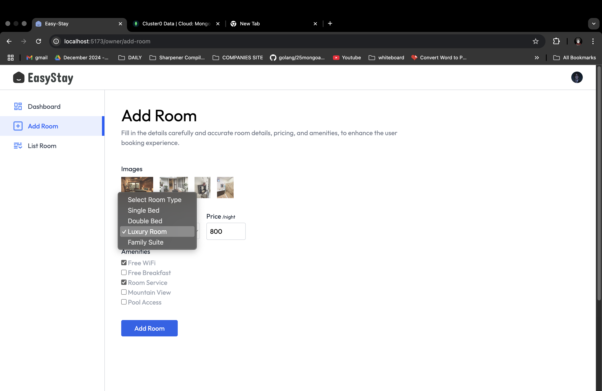 | 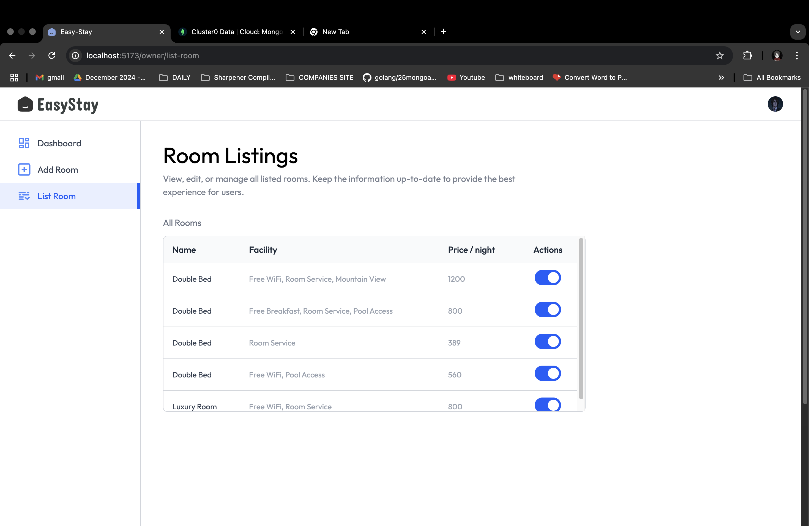 |
